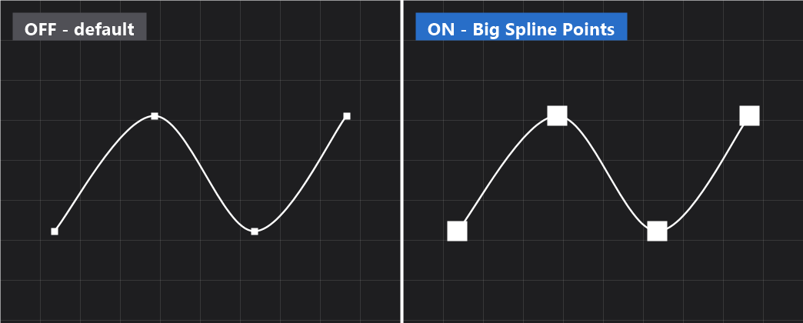

  

<h1 align="center">Big Spline Points</h1>

An editor-only Unreal Engine 5 plugin that adds a level-viewport toolbar toggle to **enlarge spline editing handles** — so spline control points and tangent handles are easier to see and grab when you're zoomed out or when points overlap.

It covers both:
- Regular `USplineComponent` control points and tangent handles, and
- Landscape spline control-point icons (in Landscape Mode).

## Features

- **One-click toolbar toggle** in the level viewport, pinned next to the transform/snapping tools.
- A **Size slider (1–100)** to dial the handle size.

## Install

1. Copy this repository into your project's `Plugins/` folder, e.g. `YourProject/Plugins/BigSplinePoints/` (the `.uplugin` should sit at `Plugins/BigSplinePoints/BigSplinePoints.uplugin`).
2. Regenerate project files and build, or just relaunch the editor and let it compile the plugin.
3. If it isn't already on, enable **Big Spline Points** under Edit → Plugins.

## Usage

Click the **Big Spline Points** button in the level-viewport toolbar to toggle the size boost on/off; use its dropdown to set the **Size**. Select a spline actor (or, for landscape splines, enter Landscape Mode with Show ▸ Splines enabled) and the control points render larger and stay easier to click.

## Compatibility

Unreal Engine 5 (editor module). Win64 / Linux / Mac.

## License

Sustainable Use License — see [LICENSE](LICENSE).
